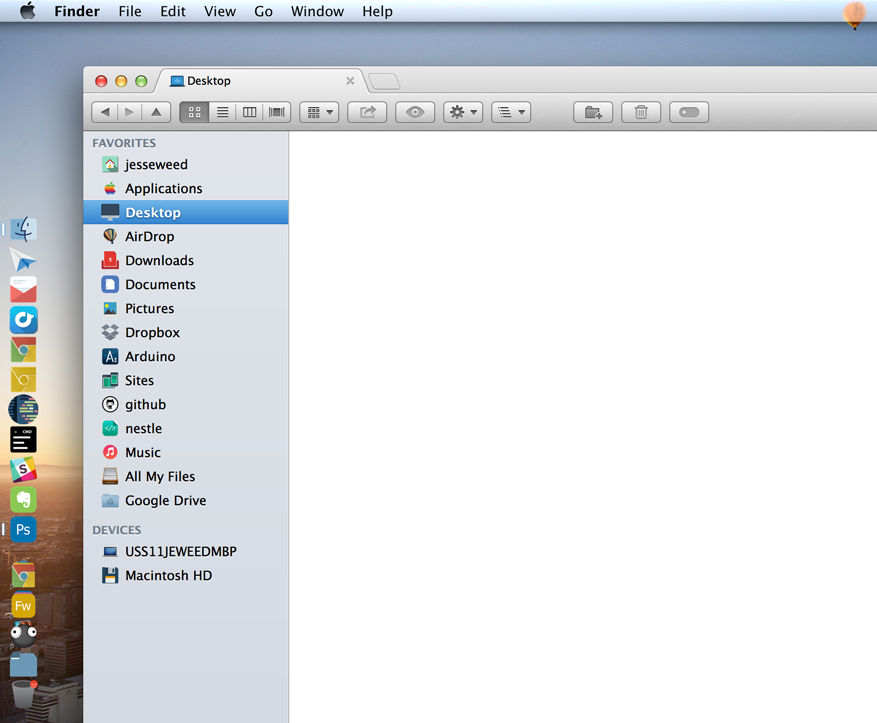
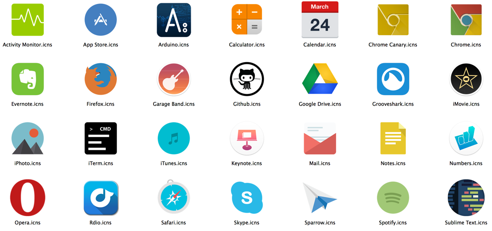

# Mac Icons
This is a collection of icons I've compiled for updating the look on my mac. I was going for a very specific minimalistic flat look, so there's no many alternate styles of icons, but if that's the look you're going for as well, then you're in luck :)

Just download the ZIP to get started. I also put together a brief guide below to walk your through how to use the icons.

*Of course make any of these changes at your own risk, I'm not respoinsible if you break something :)*

### Guide
* [Application Icons](#application-icons)
* [Document & File Icons](#document--file-icons)
* [Tools](#tools)
* [Credit](#credit)

***

### Example Icons

***

### Application Icons

Changing an icon in OS X is actually pretty simple (for most icons). Navigate to the app you want to change in finder, then right click and choose "Get Info" (or select it and press CMD + I).

##### 1. Drag your new icon onto the icon in the top left of the info pane.
(Depending on the icon, you may have to enter your password)

##### 2. All done!
Close the dialog and the icon should be updated. You may have to restart or logout to notice the change for certain icons.

### Document & File Icons
This is a little more involved, but not terribly dificult. The icon for a particular file type is determined by the application that opens it. Most of the icons in [Document Types](Document Types) I designed to use with Sublime text, so I'll use that as the example, but it's more or less the same for other applications.

1. Navigate to Sublime Text
2. Right Click > Select "Show Package Contents"
3. Navigate to Contents/Resources
4. I have names the document files to be the same as those used by Sublime Text, so for Sublime, just copy the files in [Document Types](Document Types) to Contents/Resources and you should be good to go. For other applicattions, you'll want to search for the icon you want to change to find the name, and place the icon you want to use in the directory with this name (make a backup if you want to be able to restore the original icon later).

### Tools

Heres'a a few useful tools I found for helping to apply certain system level icons.

##### System Icons
I used a combination of [LiteIcon]() and [iCondubber](http://fredericbontemps.wix.com/icondubber) to update the system icons like finder, trash, dashboard, as well as the icons in the finder sidebar (Document, Music, Pictures, etc). These 2 apps do mostly the same things, but there's a few icons I found in each that I was not able to change in the other.

##### Finder Icons
I use [Xtra Finder](http://www.trankynam.com/xtrafinder/) as a finder replacement which as a bonus allows you to go back to color icons in the finder. You will need to use something like this or [TotalFinder](http://totalfinder.binaryage.com/) if you want color icons in the finder sidebar (they have a ton of features beside just colorful icons though!).

##### Transparent Dock
If you're on Mavericks and want to get back to the 2D transparent style dock, [cDock](http://sourceforge.net/projects/cdock/) is free and works nicely.

Website: [cDock](http://sourceforge.net/projects/cdock/)

##### Converting File Types
If you want to make or download some of your own icons and need to convert an image to the .incs format, [iConvert Icons](http://iconverticons.com/) is cheap ($5) amd works great! It's what i used to create a lot of the .icns format files in this collection (many came from .png or .psd files).

### Credit

I've downloaded the majority of these icons from various free icon sources around the internet and claim no rights to any of them. If you are the creator of any of these icons and would like a credit or to have any of them removed, please let me not

##### Document Icons

Most of the document type icons were created by me, and I have included to Illustrator source files.